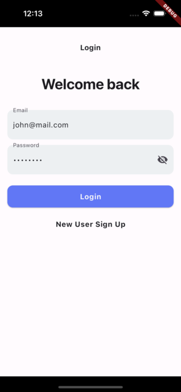
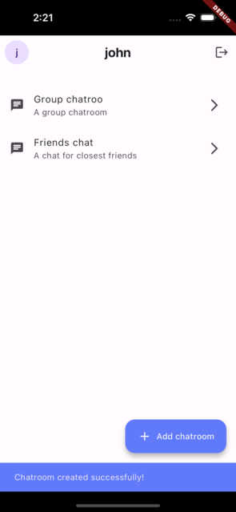
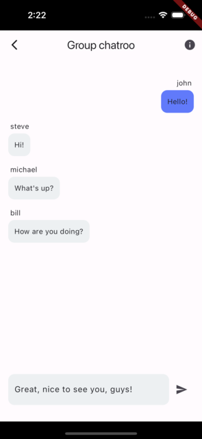
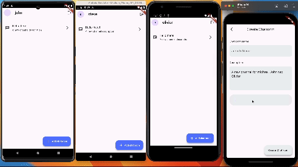
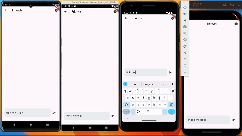

# Realtime Chat App

This project is a Flutter-based frontend for a realtime chat application, designed to work with my [NestJS backend](https://github.com/Kurczaak/chat-app).

<p align="center">
  
  
  
</p>

  
  

## Prerequisites

- Dart & Flutter: [Install Flutter](https://flutter.dev/docs/get-started/install)
- Melos: [Install Melos](https://pub.dev/packages/melos)
- Nest JS backed: [Clone Repository](https://github.com/Kurczaak/chat-app)

## Getting Started

1. **Clone the Repository:**
    ```sh
    git clone https://github.com/Kurczaak/flutter_chat_app
    ```

2. **Install Dependencies:**
    ```sh
    melos bootstrap
    ```

3. **Run Code Generators:**
    ```sh
    melos build_runner
    dart pub run build_runner build --delete-conflicting-outputs
    ```

4. **Run the Application:**
    ```sh
    flutter run
    ```


